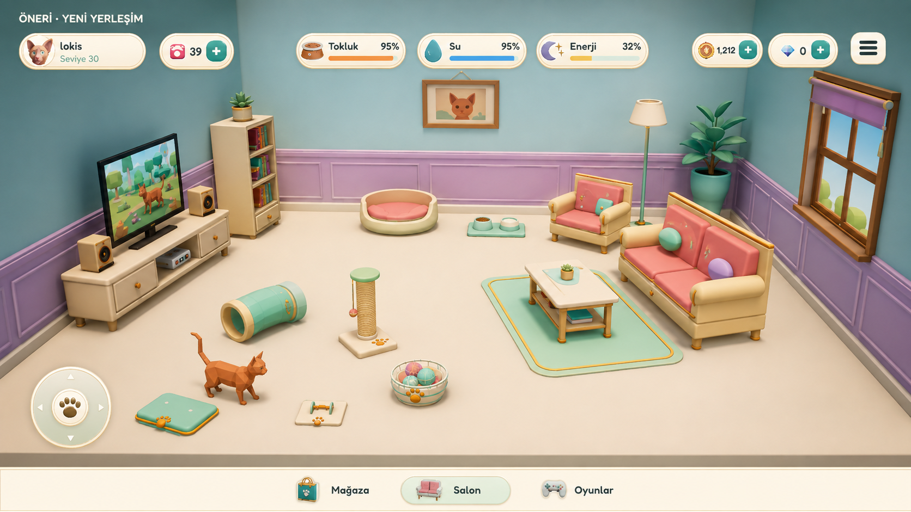
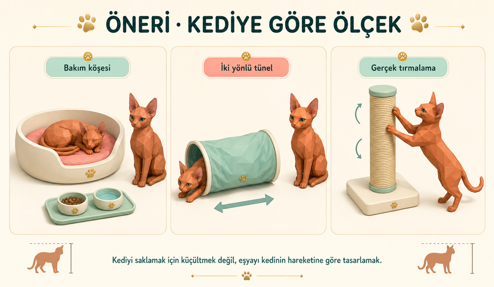

# Cat Home — oda, ölçek ve hareket önerisi

<!-- ROOM_LAYOUT_2026_09_07 -->
> **7 Eylül 2026 yerleşim güncellemesi:** Diğer yedi oda kendi 70 ROOM ürününü ortak kamera, sabit alan, oranlı ölçek ve açık etkileşim girişleriyle kullanır; CAT koleksiyonu salonda kalır. Güncel uygulama, yeni oda ekleme sözleşmesi ve doğrulama durumu [ortak oda yerleşimi raporundadır](../../ROOM_LAYOUT_IMPLEMENTATION_2026-09-07.md). Bu belgedeki önceki koordinat/ölçek/kamera kararları yeni raporla çelişirse güncel rapor geçerlidir; tarihsel test sonuçları kendi çalışmasına aittir.
<!-- /ROOM_LAYOUT_2026_09_07 -->

6 Eylül 2026 · **Kullanıcı onayladı: “Onaylıyorum. Referanstaki gibi uygula.” 7 Eylül uygulama ve doğrulama kaydı: [uygulama raporu](../../REFERENCE_LIVING_IMPLEMENTATION_2026-09-07.md).**

Bu belge ilk planlama turunun tarihsel kaydıdır. O turda mevcut kod ve sahne durumu salt okunur olarak incelendi. Buradaki görseller yerleşim ve ürün dili için üretilmiş konseptlerdir; Unity çıktısı veya mevcut modellerin birebir render'ı değildir. Sonraki onaylı uygulamanın gerçek oyun görüntüleri ve hareket kayıtları yukarıdaki rapordadır.

## 1. Anlaşılan sorun

Odanın içinden geçilebilmesi, yerleşimin iyi görünmesi ve etkileşimin anlaşılır olması için yeterli değil. Büyük ürünler, birbirini kapatan duvar mobilyaları, ilişkisi olmayan yerlere yerleşen medya ürünleri ve çok yakın aktivite alanları birlikte sorun yaratıyor. Animasyonlarda da beden hareketi ile yer değiştirme ve temas anı birbirine bağlı değil. Alt gezinme yüzeyi oyun görüntüsünü örterek bu sorunları büyütüyor.

## 2. Salonun yeni düzeni

**Kamera referansı seçildi:** kullanıcının “bu kamera açısına göre düzenle” mesajında seçtiği görsel bu salon konseptidir. Yeni yerleşimin esas kadrajı önden, merkeze yakın, hafif yukarıdan bakan ve iki yan duvarı birlikte gösteren bu görünüm olacak. Solda medya grubu, sağda oturma grubu, arkada bakım ve açık tablo; ön/orta zeminde oyun boşluğu okunacak. Mevcut sola kaymış yakın kadrajın koordinatları esas alınmayacak. Kesin kamera mesafesi ve görüş açısı, gerçek sahne üzerinde bu kompozisyonu eşleyerek belirlenecek; konseptten kesin lens değeri çıkarıldığı iddia edilmiyor.

**Uygulama durumu:** kullanıcı 6 Eylül 2026'da “Onaylıyorum. Referanstaki gibi uygula.” diyerek kalıcı kamera ve yerleşim uygulamasına açık onay verdi. Önceki onay bekleme koşulu karşılandı. Görseldeki ayrı alt şerit (A), sol medya / sağ oturma grubu ve açık oyun alanı uygulama referansıdır.

- **Sol medya grubu:** alçak TV ünitesi, üzerinde TV; konsol açık raf içinde, küçük hoparlörler TV'nin iki yanında. Eski sahiplikler ve bağlı ürün kuralları kaybolmayacak; eksik destek ürünleri olan kayıtlar ayrıca ele alınacak.
- **Sağ oturma grubu:** ikili koltuk TV'ye dönük; daha küçük berjer TV'ye açılı. Sehpa bu grubun içinde kalacak. Üstüne çıkılabilen yüzeylerle yürüyüş koridoru ayrılacak.
- **Arka duvar:** dar kitaplık bir köşede, tablo ayrı ve önü açık bir duvar bölümünde. Kamera açısından birbirlerini kapatmaları da kontrol edilecek.
- **Sessiz bakım alanı:** ana yatak, mama ve su arkada; koltuk altına veya geçiş yoluna düşmeyecek. Kaselere iki yandan yaklaşılabilecek.
- **Oyun alanı:** kompakt oyuncaklar ayrı ceplerde; ortada kesintisiz hareket boşluğu. Görünen zeminin yaklaşık %35–40'ının açık okunması bir kompozisyon hedefi; uygulamada aynı kameradan ölçülecek.

Otomatik yerleşim, tam ROOM koleksiyonu satın alınmışken de çalışmalı. Beş CAT ürünü bir üst sınır; yerleşimin amacı boşluğu mutlaka beş eşya ile doldurmak değil. Kullanıcının onayladığı **aynı anda en fazla 5 seçilebilir CAT ürünü, bunlardan en fazla 1 yatak** kuralı korunacak. Ana bakım yatağı ayrı, kalıcı bakım nesnesidir.

Yerleşimde ürünün dış kutusuna ek olarak kedinin yaklaşma, dönme, pati uzatma, atlama ve çıkış alanı hesaba katılacak. Tünelin iki ağzı da açık kalacak. Medya grubu gibi birlikte bulunması gereken ürünlerde farklı etkileşimlerin birbirini seçmesi, ürüne dokunarak seçim ve seçili nesneyi belirginleştirme ile çözülecek. Tek eylem alanında ürün adı gösterilecek; en yakın nesne değişti diye etiket her karede başka eyleme dönüşmeyecek.

## 3. Ölçek ve bakım ürünleri

Kapsam yalnız salon değildir: sekiz odadaki 80 ROOM ürünü, 17 CAT ürünü ve kalıcı temel eşyalar incelenecek. Her nesneye aynı küçültme oranı uygulanmayacak. Referans ölçüler kuyruğu ve kulakları kapsayan dış kutu yerine kedinin burun–sağrı uzunluğu ve omuz yüksekliğidir. On ırkın doğal farkları korunacak.

İlk tasarım hedefleri, kesin metre ölçüleri değildir:

| Ürün | Oran hedefi |
|---|---|
| Yatak içi | Kedi gövde uzunluğunun yaklaşık 1,3–1,6 katı |
| Tek kase çapı | Gövde uzunluğunun yaklaşık 0,3–0,4 katı |
| Tünel boyu | Gövde uzunluğunun yaklaşık 1,3–1,5 katı |
| Tünel iç açıklığı | En büyük ırkın gerçek çömelme pozu ve kuyruk hareketinden ölçülecek |
| Konsol genişliği | TV genişliğinin yaklaşık %25–30'u |
| Her hoparlör | TV genişliğinin yaklaşık %12–18'i |

Önce eşya oranları düzeltilecek. Kedinin boyutunda değişiklik ancak bütün odalar ve on ırk birlikte değerlendirildiğinde gerekirse yapılacak; o durumda çarpışma alanı, adım mesafesi ve temas noktaları da beraber uyarlanacak.

Yeni ana yatak alçak girişli, ivory gövdeli ve çıkarılabilir mercan minderli olacak. Mama ve su küçük seramik kaplarda, ince mint bir altlıkta yer alacak. Yemek, içmek ve kıvrılarak yatmak için gerçek yüzey temasları ölçülecek. Dinlenirken enerji artışı korunacak. Yeniden tasarlanan satılabilir ürünlerin mağaza görselleri, oyuncuya verilen son prefab üzerinden tümüyle yenilenecek ve görsel olarak kontrol edilecek.

Tünelin mevcut .60 yüksekliği daha önce tüm ırkların kumaş içinde kalması için gerekli bulunmuş. Sadece yüksekliği azaltmak eski kesişmeyi geri getirir. Önce uygun çömelme pozu, sonra kısa gövde ve ince dış yapı tasarlanacak; iki uçtan giriş, içeride kuyruk açıklığı, çıkış ve iptal ayrıca doğrulanacak.

## 4. Hareket ve etkileşim

**Tırmalama:** arka patiler zeminde sabit, gövde yükselmiş; iki ön pati sırayla ip yüzeyini kavrayıp aşağı çekecek. Omuz, dirsek ve sırt hareketi buna eşlik edecek. Direkteki oyuncak varsa pati temasının ve titreşimin zamanlaması aynı hareketten türetilecek.

**Zıplama:** hazırlık/çömelme → arka patilerle itiş → havada uygun beden pozu → ön patilerle temas, arka patiler ve kısa toparlanma. Süre ve yay yüksekliği hedefin yüksekliğine ve yatay uzaklığa göre değişecek. Koltuk, sehpa ve diğer odalardaki atlamalar ortak denetimden geçecek. Temastan önce kedi havada yürümeyecek; inişte yüzeye gömülmeyecek.

**Analog hareket:** hafif çekişte kısa ve yavaş adımlar, orta çekişte normal yürüyüş, tam çekişte enerji uygunsa koşu. Yürüme döngüsü kedinin gerçekten aldığı mesafeyle eşleştirilecek. Engel karşısında ileri gidemeyen kedi yürüme döngüsünü sürdürmeyecek. Koşu/yürüme sınırında titremeyen geçiş; düşük enerjide tam çekişte yürüyüş. Gerçek koşu süresi ile enerji tüketimi aynı koşula bağlanacak.

**Tünel:** en yakın erişilebilir ağız giriş, karşı ağız çıkış olacak; oyuncu iki taraftan da başlatabilecek. Giriş ve çıkış yolları başka eşyanın içinden geçmeyecek.

**Top ve yüzey etkileşimleri:** mevcut top oyunu ve sehpadan nesne itme, aynı temas/zamanlama kontrolüne dahil. Topun hareketi pati temasından sonra başlayacak; kedinin takip yönü ve duruşu topun gerçek konumuna uyacak.

## 5. TV içeriği

TV'de kendi kedi modellerimizle hazırlanmış kısa hareketli sahneler oynayacak: top peşinde koşma, kelebek izleme ve uyuklama gibi. Ekran yalnız statik bir resim olmayacak. İlk tercih, kendi sahnemizden üretilen kısa ve döngüye uygun video; görüntü kalitesi ve cihaz maliyeti açısından değerlendirilerek gerekirse ayrı küçük sahne kamerası kullanılacak. Oda görünmüyorken gereksiz oynatma/render yükü duracak. Kamera kullanılırsa ana odanın tek etkin kamera düzeni bozulmayacak.

## 6. Alt gezinme için karar

**A — önerilen:** 1080p referansta yaklaşık 64–80 px yüksekliğinde sade alt gezinme alanı. Oda kamerası bu alanın üstünde biter; mobilyanın veya animasyonun üzerine düğme çizilmez. Mağaza, Salon ve Oyunlar doğrudan erişilir. Bedeli, sabit bir miktar görüntü yüksekliğidir; kamera kadrajı bu alana göre yeniden ayarlanır.

**B — alternatif:** alt bar kaldırılır, üstteki Yuva menüsünden Mağaza/Odalar/Oyunlar açılır. Zeminde en fazla boşluğu sağlar; geçişler bir ek dokunuş ister. Menü açıkken oda etkileşimi durur.

Her iki çözümde analog için ayrılan sol alt kontrol alanına eşya/etkileşim hedefi yerleştirilmez. Tek bağlamsal eylem düğmesi ve ilerleme, seçili nesneyi kapatmayan güvenli ekran bölgesinde kalır. Bu düzen 16:9, dar ekran ve geniş ekran için ayrıca kadrajlanacak; yalnız saydamlık veya barı birkaç piksel aşağı taşımakla çözülmüş sayılmayacak.

## 7. Onaydan sonraki sıra ve kabul koşulları

1. Bütün ürünlerin kediye göre oran envanteri ve salonun basit yerleşim denemesi. Tam koleksiyon ve farklı beşli CAT seçimleriyle geçiş/etkileşim boşlukları.
2. Ölçek düzeltmeleri, medya grubu, tablo/kitaplık, modern bakım köşesi, kompakt çift girişli tünel. Blender gerekiyorsa yalnız arka planda mevcut üretim hattıyla.
3. Yürüme/koşu, gerçek zıplama, iki pati tırmalama ve nesne teması. Önce ortak hareket sistemi, sonra oda başına temas noktaları.
4. Onaylanan alt gezinme seçeneği, kamera kadrajları, sabit ve anlaşılır eylem seçimi, hareketli TV içeriği.
5. Mağaza ürünleri ve oda ön izlemelerini son modellerle yenileme. Gerçek oyundan önce/sonra kareleri ve normal hızda hareket kayıtları.

Kontroller yalnız sayısal test sonuçlarından ibaret olmayacak: tüm ırklarda ayak kayması, tırmalamada iki el teması, atlayış ve iniş, tünelin iki yönü; tam döşeli odada görüş engeli; farklı ekran oranlarında düğme/nesne görünürlüğü değerlendirilecek. Otomatik testler, LevelContentValidator ve gerçek oyun görüntüleri birlikte kullanılacak. QA yalnız kayıt kopyasında yapılacak; normal düzenleme görünümü üç sahneli ev yığınına dönecek. Gerçek cihaz performansı ölçülmeden mobil kalite/maliyet doğrulanmış sayılmayacak.

**Karar verildi:** kullanıcı yerleşim/ürün oranları/animasyon yönünü ve referanstaki ayrı alt şeridi (A) onayladı. Bu bölüm tarihsel plan metnidir; güncel sonuç için uygulama raporuna bakılır.

## İncelemede kullanılan mevcut kaynaklar

- `Assets/Editor/StoreCatalogAssets.cs`: ürün ölçüleri ve tasarlanmış konumlar.
- `Assets/Scripts/CatMovement.cs`: analog giriş, hareket ve animasyon hızı ilişkisi.
- `Assets/Scripts/Activities/CatActivityAnimation.cs`: Scratch/Paw durum eşlemesi.
- `ScratchPostActivity`, `LivingFurnitureActivity`, `CatEnrichmentActivity`: tırmalama, atlama ve tünel akışı.
- `ActivityPromptController`: en yakın aktivite seçimi.
- `Docs/PREMIUM_FURNITURE_LANGUAGE.md`: mevcut ürün tasarım ve üretim dili.

Konseptler yerleşik imagegen aracıyla üretildi. Üretim istemleri `CONCEPT_PROMPTS.md` dosyasındadır. Görsellerdeki kedi ve eşyalar tasarım temsilleridir; uygulamada mevcut varlıkların kimliği ve iskelet uyumluluğu esas alınacaktır.
